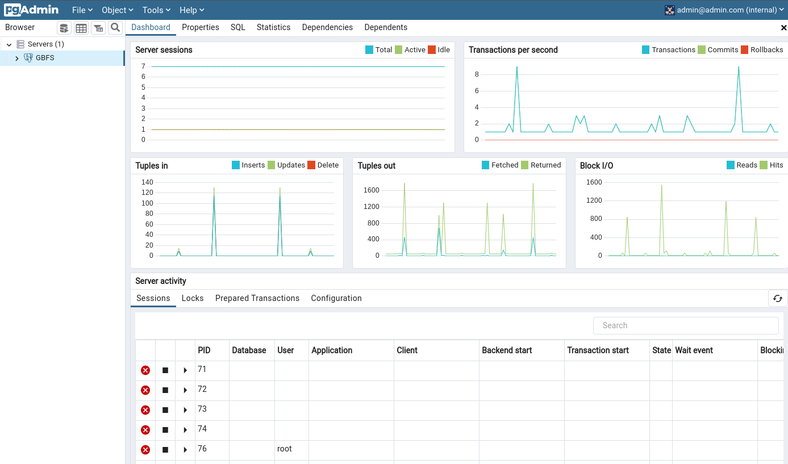
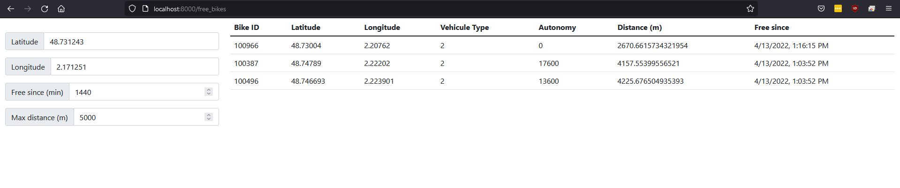
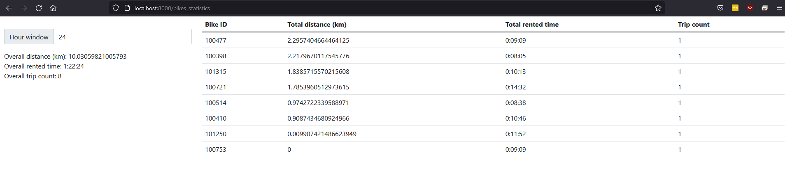

# zoov-bikes-gbfs-postgres-pgadmin-flask

# 🚀 track free bikes provided by Zoov in Saclay/South Paris. The system also keep track of bike usage (total distance traveled for all bikes or for a specific bike, total rented time for all bikes or for a specific bike). 🚀

https://github.com/coding-to-music/zoov-bikes-gbfs-postgres-pgadmin-flask

From / By Gaëtan Le FRIOUX https://github.com/gaetanlefrioux/zoov_bikes

https://github.com/gaetanlefrioux/zoov_bikes

## Environment variables:

```java

```

## GitHub

```java
git init
git add .
git remote remove origin
git commit -m "first commit"
git branch -M main
git remote add origin git@github.com:coding-to-music/zoov-bikes-gbfs-postgres-pgadmin-flask.git
git push -u origin main
```

## pgadmin PostgreSQL Admin UI

http://localhost:5050/browser/

Log in:

- PGADMIN_DEFAULT_EMAIL: admin@admin.com
- PGADMIN_DEFAULT_PASSWORD: root

Create Database Connection:

- ConnectionName: GBFS
- Hostname:
- Username: admin
- Password: root



## App UI

There is no index page at http://localhost:8000

```
Not Found
The requested URL was not found on the server. If you entered the URL manually please check your spelling and try again.
```

Use these routes:

http://localhost:8000/free_bikes

http://localhost:8000/bikes_statistics

1. At `/free_bikes` you can monitor free bikes available near a given location since a given period of time

2. At `/bikes_statistics` you can monitor the total distance, total rented time and trip count for each bike and overall for a given time window

## docker ps

```
docker ps
```

Output:

```
CONTAINER ID   IMAGE                                                              COMMAND                  CREATED          STATUS                    PORTS                                            NAMES
878860a0cf09   dpage/pgadmin4                                                     "/entrypoint.sh"         48 minutes ago   Up 48 minutes             443/tcp, 0.0.0.0:5050->80/tcp, :::5050->80/tcp   pgadmin_container
3f5fd4c9f8f9   zoov-bikes-gbfs-postgres-pgadmin-flask_free_bikes_saclay_watcher   "python3 feed_watche…"   48 minutes ago   Up 48 minutes                                                              free_bikes_saclay_watcher
45fab3944b05   zoov-bikes-gbfs-postgres-pgadmin-flask_web_app                     "python3 -m flask ru…"   48 minutes ago   Up 48 minutes             0.0.0.0:8000->5000/tcp, :::8000->5000/tcp        web_app
b3ec7093a5b4   postgres                                                           "docker-entrypoint.s…"   48 minutes ago   Up 48 minutes (healthy)   0.0.0.0:5432->5432/tcp, :::5432->5432/tcp        pg_container
```

## docker-compose down

```
docker-compose down
```

Output

```
Stopping pgadmin_container         ... done
Stopping free_bikes_saclay_watcher ... done
Stopping web_app                   ... done
Stopping pg_container              ... done
Removing pgadmin_container         ... done
Removing free_bikes_saclay_watcher ... done
Removing web_app                   ... done
Removing pg_container              ... done
Removing network zoov-bikes-gbfs-postgres-pgadmin-flask_default
```

# System Overview

This repository aim to create a basic system to track free bikes provided by [Zoov](https://www.zoov.eu/) in Saclay/South Paris.
The system also keep track of bike usage (total distance traveled for all bikes or for a specific bike, total rented time for all bikes or for a specific bike).

## Usage

Docker is required to build and launch the system.
A simple `docker-compose up --build` in the root directory will build and run all the system services.

## System main components

### Feed Watcher

This component is written in `Python`.
The [feed_watcher](https://github.com/gaetanlefrioux/zoov_bikes/blob/main/feed_watcher/feed_watcher.py) is taking care of tracking updates from the given feed.
The feed_watcher is parsing and formatting the feed data before loading them to the specified table in the database.

Each feed_watcher is accepting a JSON configuration file which tells: the url of the data feed, the parser to use, how to map the fields with the database, ...

Here only one feed_watcher is used to track data from the [free_bikes_status feed for Saclay/South Paris](https://gateway.prod.zoov.io/gbfs/2.2/saclay/en/free_bike_status.json?key=NGFlMjU3MDUtNDk5My00MTM4LTk1ZjctNmNlNDM1MWQ0NjE1).
Its configuration file can be found [here](https://github.com/gaetanlefrioux/zoov_bikes/blob/main/feed_watcher/configs/free_bike_status_saclay.json).

### Database

The `postgres` service holds a PostgreSQL database where the feed data are aggregated and stored

The tables used to stored the data are defined [here](https://github.com/gaetanlefrioux/zoov_bikes/blob/main/db/sql/create_tables.sql).<br>
The logic to aggregate the new data coming from the feed is defined as a SQL function [here](https://github.com/gaetanlefrioux/zoov_bikes/blob/main/db/sql/func_aggregate_free_bikes.sql) for sake of performance.

Additionally, a pgadmin4 container is also running alongside the PostgreSQL container to facilitate monitoring of the database.

## App

The `web_app` service holds a minimalist web application implemented with python and [Flask](https://flask.palletsprojects.com/).

This web application is exposed on port `8000`.

This webapp provide two features:<br>

1. At `/free_bikes` you can monitor free bikes available near a given location since a given period of time



2. At `/bikes_statistics` you can monitor the total distance, total rented time and trip count for each bike and overall for a given time window



## Remarks and limitations

First of all, it is important to note that this system is only capable of keeping track of bikes movements because the [free_bikes_status feed for Saclay/South Paris](https://gateway.prod.zoov.io/gbfs/2.2/saclay/en/free_bike_status.json?key=NGFlMjU3MDUtNDk5My00MTM4LTk1ZjctNmNlNDM1MWQ0NjE1) is not fully following the [GBFS specification for the free_bike_status feed](https://github.com/NABSA/gbfs/blob/v2.2/gbfs.md#free_bike_statusjson) which says:

- The bike_id identifier MUST be rotated to a random string after each trip to protect user privacy (as of v2.0). Use of persistent vehicle IDs poses a threat to user privacy. The bike_id identifier SHOULD only be rotated once per trip.

Thus, this system might not work on other free_bike_status feeds.

Also, because the system only see bikes that are currently free, it can only deduce bike rental starting and ending points. From these information we can estimate the distance traveled by the bike by computing the direct distance between the two points. However this distance can be fairly different from the real traveled distance.

The system is unable to accurately compute revenue generated by the bikes. This feature could be implemented by adding a feed watcher for the [pricing_plan feed](https://gateway.prod.zoov.io/gbfs/2.2/saclay/en/system_pricing_plans.json?key=NGFlMjU3MDUtNDk5My00MTM4LTk1ZjctNmNlNDM1MWQ0NjE1) to keep track of pricing plan changes for each bike.

Connectivity issue between the feed watchers and the database will lead to data loss. To avoid that, new data coming from the watched feed should be cached by the feed watcher. To address this issue and also to grow the system with multiple other feeds a message broker like [Kafka](https://kafka.apache.org/) could be used.
